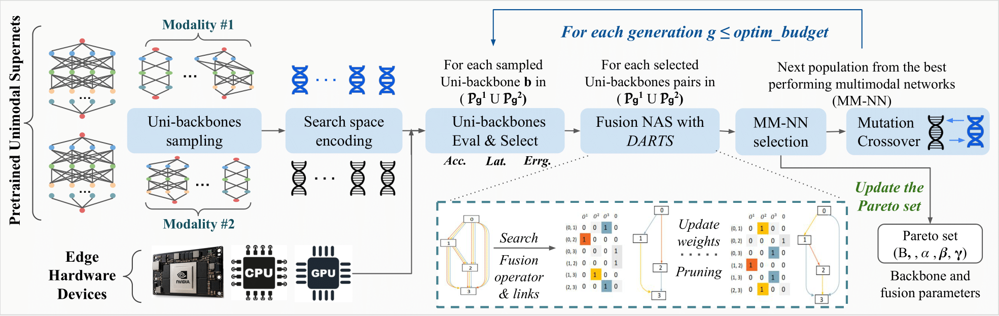
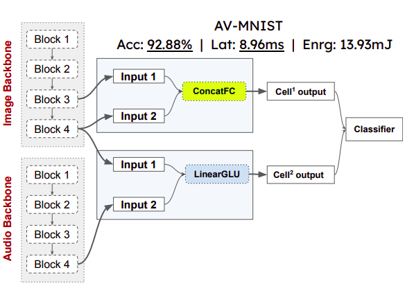

# Harmonic-NAS
*Harmonic-NAS* is a novel framework for the design of multimodal neural networks on resource-constrained devices. It employs a two-tier optimization strategy with an outer evolutionary search stage for the unimodal backbone networks and an inner differentiable search stage for the multimodal fusion network architecture. *Harmonic-NAS* also includes the hardware dimension in its optimization procedure by assessing the inference latency and energy consumption.




# Requirements

- Python version: tested in Python 3.8.10
- Install the software environment in the yaml file [*environment.yml*](./environment.yml)


# Code Structure
```
Harmonic-NAS/
 ├── backbones/
 |    ├── maxout/ --- Our Maxout network configuration
 |    └── ofa/ --- Original scripts from once-for-all for supernet specifications
 | 
 ├── configs/ --- Running configs for Harmonic-NAS search
 ├── data/ --- Essential scripts for data loading for our various datasets
 ├── evaluate/
 |    ├── backbone_eval/
 |    |    ├── accuracy/ --- Essential scripts for evaluating the accuracy of the explored uni/multi-modal models
 |    |    └── efficiency/ --- LUTs for evaluating the efficiency of our modality specific supernets on the targeted Edge devices
 |    └── fusion_eval/ --- LUTs for evaluating the efficiency of our fusion operators on the targeted Edge devices
 | 
 ├── fusion_search/ --- Scripts for the second-stage of optimization (fusion search)
 ├── saved_supernets/ --- Pretrained supernets for different modalities/datasets
 ├── utils/ --- Essential scripts for managing distributed training/evaluation across multiple GPUs
 ├── best_mm_model.py --- Script for the fusion micro-architecture seach for our best found multimodal models
 └── search_algo.py --- Main script for Harmonic-NAS search
```

# Pretrained Supernets on Multimodal Datasets:
The following table provides a list of the employed backbones and supernets with their weights:
| Dataset | Modality | Baseline Model Architecture| Max subnet Accuracy | Pretrained weights |
|:---:|:---:|:---:|:---:|:---:|
| AV-MNIST | Image | ofa_mbv3_d234_e346_k357_w1.0 | 86.44 | [Link](https://drive.google.com/file/d/1ff9-jsQ4shX7WwGZJZSXFAPQpET7Ek0k/view?usp=drive_link) |
| AV-MNIST | Audio | ofa_mbv3_d234_e346_k357_w1.0 | 88.22 | [Link](https://drive.google.com/file/d/1ytXHYMc2KKg1phGOLCzqIKcJP-5VmNOw/view?usp=drive_link) |
| MM-IMDB | Image | ofa_mbv3_d234_e346_k357_w1.2 | 46.26 | [Link](https://drive.google.com/file/d/1JnCFxZHNZA6AfkpfuxbGTeAgZQCi59gR/view?usp=drive_link) |
| MM-IMDB | Text | Maxout | 61.21 | [Link](https://drive.google.com/file/d/1hR7o-UeuLasLyeNBsr181ALaAjOCLRIc/view?usp=drive_link) |
| Memes_Politics | Image | ofa_mbv3_d234_e346_k357_w1.0 | 84.78 | [Link](https://drive.google.com/file/d/14RYsdyVWmoTzgmQIoMDaP1ztHXPdNOZw/view?usp=drive_link) |
| Memes_Politics | Text | Maxout | 83.38 | [Link](https://drive.google.com/file/d/1GlHRzPmMTa-BPx6n8gDTH79PXR54PxWy/view?usp=drive_link) |

# Dataset Pre-processing

## AV-MNIST dataset: 
Donwload the AV-MNIST from the original repo [SMIL](https://github.com/mengmenm/SMIL) , or direcly from [Link](https://drive.google.com/file/d/1JTS--8d_BxzZfhQfSAAYeYTjCdUbJyuD/view).

## MM-IMDB dataset: 
Download the **multimodal_imdb.hdf5** file from the original repo of [MM-IMDB](https://github.com/johnarevalo/gmu-mmimdb) using the [Link](https://archive.org/download/mmimdb/multimodal_imdb.hdf5).<br>
Use the pre-processing script to split the dataset.

```shell
$ python data/mmimdb/prepare_mmimdb.py
```

## Memes-Polotics dataset: 
Download the different files for Meme Images and Annotations <br><br>
Harm-P: [Link](https://drive.google.com/file/d/1fw850yxKNqzpRpQKH88D13yfrwX1MLde/view?usp=sharing)

Entity features: [Link](https://drive.google.com/file/d/1KBltp_97CJIOcrxln9VbDfoKxbVQKcVN/view?usp=sharing)

ROI features: [Link](https://drive.google.com/file/d/1KRAJcTme4tmbuNXLQ72NTfnQf3x2YQT_/view?usp=sharing)


Download the required vocabulary file:
```shell
$ wget https://openaipublic.azureedge.net/clip/bpe_simple_vocab_16e6.txt.gz -O bpe_simple_vocab_16e6.txt.gz
```


# Run Experiments
In Harmonic-NAS, we conducted experiments within a distributed environment. To replicate these experiments, follow these steps:<br>
Modify the configuration file located in [./configs](./configs) to match your desired settings.<br>
Run the following command to initiate the Harmonic-NAS search.
```shell
$ python search_algo_DATASET.py
```

To reproduce the results achieved by our top-performing multimodal models without undergoing the entire Harmonic-NAS search process, simply specify the desired backbones architectures and the fusion macro-architecture (as detailed in [Best Models Configuration](#best-models-configuration)) within the following script:
```shell
$ python best_mm_model_DATASET.py
```

# Best Models Configuration

The architectural configuration of our top-performing multimodal models and their efficiency on the NVIDIA Jetson TX2, as described in our paper [Harmonic-NAS: Hardware-Aware Multimodal Neural Architecture Search on Resource-constrained Devices](https://arxiv.org/pdf/2309.06612.pdf).


### AV-MNIST
<table style="border-collapse: collapse; border: none; border-spacing: 0px;">	<tr>		<td colspan="4" style="border-bottom: 1px solid rgb(0, 0, 0); border-right: 1px solid rgb(0, 0, 0); border-top: 1px solid rgb(0, 0, 0); text-align: center; padding-right: 3pt; padding-left: 3pt;">			Image Backbone		</td>		<td colspan="4" style="border-width: 1px; border-style: solid; border-color: rgb(0, 0, 0); text-align: center; padding-right: 3pt; padding-left: 3pt;">			Audio Backbone		</td>		<td colspan="2" style="border-width: 1px; border-style: solid; border-color: rgb(0, 0, 0); text-align: center; padding-right: 3pt; padding-left: 3pt;">			Fusion Network		</td>		<td colspan="3" style="border-bottom: 1px solid rgb(0, 0, 0); border-left: 1px solid rgb(0, 0, 0); border-top: 1px solid rgb(0, 0, 0); text-align: center; padding-right: 3pt; padding-left: 3pt;">			Multimodal Evaluation		</td>	</tr>	<tr>		<td style="border-top: 1px solid rgb(0, 0, 0); border-bottom: 1px solid rgb(0, 0, 0); text-align: center; padding-right: 3pt; padding-left: 3pt;">			Acc		</td>		<td style="border-top: 1px solid rgb(0, 0, 0); border-bottom: 1px solid rgb(0, 0, 0); text-align: center; padding-right: 3pt; padding-left: 3pt;">			K		</td>		<td style="border-top: 1px solid rgb(0, 0, 0); border-bottom: 1px solid rgb(0, 0, 0); text-align: center; padding-right: 3pt; padding-left: 3pt;">			E		</td>		<td style="border-top: 1px solid rgb(0, 0, 0); border-right: 1px solid rgb(0, 0, 0); border-bottom: 1px solid rgb(0, 0, 0); text-align: center; padding-right: 3pt; padding-left: 3pt;">			D		</td>		<td style="border-top: 1px solid rgb(0, 0, 0); border-left: 1px solid rgb(0, 0, 0); border-bottom: 1px solid rgb(0, 0, 0); text-align: center; padding-right: 3pt; padding-left: 3pt;">			Acc		</td>		<td style="border-top: 1px solid rgb(0, 0, 0); border-bottom: 1px solid rgb(0, 0, 0); text-align: center; padding-right: 3pt; padding-left: 3pt;">			K		</td>		<td style="border-top: 1px solid rgb(0, 0, 0); border-bottom: 1px solid rgb(0, 0, 0); text-align: center; padding-right: 3pt; padding-left: 3pt;">			E		</td>		<td style="border-top: 1px solid rgb(0, 0, 0); border-right: 1px solid rgb(0, 0, 0); border-bottom: 1px solid rgb(0, 0, 0); text-align: center; padding-right: 3pt; padding-left: 3pt;">			D		</td>		<td style="border-top: 1px solid rgb(0, 0, 0); border-left: 1px solid rgb(0, 0, 0); border-bottom: 1px solid rgb(0, 0, 0); text-align: center; padding-right: 3pt; padding-left: 3pt;">			Cells		</td>		<td style="border-top: 1px solid rgb(0, 0, 0); border-right: 1px solid rgb(0, 0, 0); border-bottom: 1px solid rgb(0, 0, 0); text-align: center; padding-right: 3pt; padding-left: 3pt;">			Nodes		</td>		<td style="border-top: 1px solid rgb(0, 0, 0); border-left: 1px solid rgb(0, 0, 0); border-bottom: 1px solid rgb(0, 0, 0); text-align: center; padding-right: 3pt; padding-left: 3pt;">			Acc		</td>		<td style="border-top: 1px solid rgb(0, 0, 0); border-bottom: 1px solid rgb(0, 0, 0); text-align: center; padding-right: 3pt; padding-left: 3pt;">			Lat		</td>		<td style="border-top: 1px solid rgb(0, 0, 0); border-bottom: 1px solid rgb(0, 0, 0); text-align: center; padding-right: 3pt; padding-left: 3pt;">			Enr		</td>	</tr>	<tr>		<td style="border-bottom: 1px solid rgb(0, 0, 0); border-top: 1px solid rgb(0, 0, 0); text-align: center; padding-right: 3pt; padding-left: 3pt;">			79.77		</td>		<td style="border-bottom: 1px solid rgb(0, 0, 0); border-top: 1px solid rgb(0, 0, 0); text-align: center; padding-right: 3pt; padding-left: 3pt;">			[5,5,5,5]		</td>		<td style="border-bottom: 1px solid rgb(0, 0, 0); border-top: 1px solid rgb(0, 0, 0); text-align: center; padding-right: 3pt; padding-left: 3pt;">			[3,3,4,3]		</td>		<td style="border-right: 1px solid rgb(0, 0, 0); border-bottom: 1px solid rgb(0, 0, 0); border-top: 1px solid rgb(0, 0, 0); text-align: center; padding-right: 3pt; padding-left: 3pt;">			[2]		</td>		<td style="border-left: 1px solid rgb(0, 0, 0); border-bottom: 1px solid rgb(0, 0, 0); border-top: 1px solid rgb(0, 0, 0); text-align: center; padding-right: 3pt; padding-left: 3pt;">			85.55		</td>		<td style="border-bottom: 1px solid rgb(0, 0, 0); border-top: 1px solid rgb(0, 0, 0); text-align: center; padding-right: 3pt; padding-left: 3pt;">			[3,3,7,3]		</td>		<td style="border-bottom: 1px solid rgb(0, 0, 0); border-top: 1px solid rgb(0, 0, 0); text-align: center; padding-right: 3pt; padding-left: 3pt;">			[3,3,3,6]		</td>		<td style="border-right: 1px solid rgb(0, 0, 0); border-bottom: 1px solid rgb(0, 0, 0); border-top: 1px solid rgb(0, 0, 0); text-align: center; padding-right: 3pt; padding-left: 3pt;">			[2]		</td>		<td style="border-left: 1px solid rgb(0, 0, 0); border-bottom: 1px solid rgb(0, 0, 0); border-top: 1px solid rgb(0, 0, 0); text-align: center; padding-right: 3pt; padding-left: 3pt;">			2		</td>		<td style="border-right: 1px solid rgb(0, 0, 0); border-bottom: 1px solid rgb(0, 0, 0); border-top: 1px solid rgb(0, 0, 0); text-align: center; padding-right: 3pt; padding-left: 3pt;">			1		</td>		<td style="border-left: 1px solid rgb(0, 0, 0); border-bottom: 1px solid rgb(0, 0, 0); border-top: 1px solid rgb(0, 0, 0); text-align: center; padding-right: 3pt; padding-left: 3pt;">			92.88		</td>		<td style="border-bottom: 1px solid rgb(0, 0, 0); border-top: 1px solid rgb(0, 0, 0); text-align: center; padding-right: 3pt; padding-left: 3pt;">			<b>8.96</b>		</td>		<td style="border-bottom: 1px solid rgb(0, 0, 0); border-top: 1px solid rgb(0, 0, 0); text-align: center; padding-right: 3pt; padding-left: 3pt;">			13.93		</td>	</tr>	<tr>		<td style="border-top: 1px solid rgb(0, 0, 0); border-bottom: 1px solid rgb(0, 0, 0); text-align: center; padding-right: 3pt; padding-left: 3pt;">			77.55		</td>		<td style="border-top: 1px solid rgb(0, 0, 0); border-bottom: 1px solid rgb(0, 0, 0); text-align: center; padding-right: 3pt; padding-left: 3pt;">			[3,5,7,3]		</td>		<td style="border-top: 1px solid rgb(0, 0, 0); border-bottom: 1px solid rgb(0, 0, 0); text-align: center; padding-right: 3pt; padding-left: 3pt;">			[3,3,3,6]		</td>		<td style="border-right: 1px solid rgb(0, 0, 0); border-top: 1px solid rgb(0, 0, 0); border-bottom: 1px solid rgb(0, 0, 0); text-align: center; padding-right: 3pt; padding-left: 3pt;">			[2]		</td>		<td style="border-left: 1px solid rgb(0, 0, 0); border-top: 1px solid rgb(0, 0, 0); border-bottom: 1px solid rgb(0, 0, 0); text-align: center; padding-right: 3pt; padding-left: 3pt;">			85.77		</td>		<td style="border-top: 1px solid rgb(0, 0, 0); border-bottom: 1px solid rgb(0, 0, 0); text-align: center; padding-right: 3pt; padding-left: 3pt;">			[3,5,5,5]		</td>		<td style="border-top: 1px solid rgb(0, 0, 0); border-bottom: 1px solid rgb(0, 0, 0); text-align: center; padding-right: 3pt; padding-left: 3pt;">			[3,3,3,3]		</td>		<td style="border-right: 1px solid rgb(0, 0, 0); border-top: 1px solid rgb(0, 0, 0); border-bottom: 1px solid rgb(0, 0, 0); text-align: center; padding-right: 3pt; padding-left: 3pt;">			[2]		</td>		<td style="border-left: 1px solid rgb(0, 0, 0); border-top: 1px solid rgb(0, 0, 0); border-bottom: 1px solid rgb(0, 0, 0); text-align: center; padding-right: 3pt; padding-left: 3pt;">			3		</td>		<td style="border-right: 1px solid rgb(0, 0, 0); border-top: 1px solid rgb(0, 0, 0); border-bottom: 1px solid rgb(0, 0, 0); text-align: center; padding-right: 3pt; padding-left: 3pt;">			4		</td>		<td style="border-left: 1px solid rgb(0, 0, 0); border-top: 1px solid rgb(0, 0, 0); border-bottom: 1px solid rgb(0, 0, 0); text-align: center; padding-right: 3pt; padding-left: 3pt;">			<b>95.55</b>		</td>		<td style="border-top: 1px solid rgb(0, 0, 0); border-bottom: 1px solid rgb(0, 0, 0); text-align: center; padding-right: 3pt; padding-left: 3pt;">			14.41		</td>		<td style="border-top: 1px solid rgb(0, 0, 0); border-bottom: 1px solid rgb(0, 0, 0); text-align: center; padding-right: 3pt; padding-left: 3pt;">			25.49		</td>	</tr>	<tr>		<td style="border-bottom: 1px solid rgb(0, 0, 0); border-top: 1px solid rgb(0, 0, 0); text-align: center; padding-right: 3pt; padding-left: 3pt;">			82.66		</td>		<td style="border-bottom: 1px solid rgb(0, 0, 0); border-top: 1px solid rgb(0, 0, 0); text-align: center; padding-right: 3pt; padding-left: 3pt;">			[5,5,5,7]		</td>		<td style="border-bottom: 1px solid rgb(0, 0, 0); border-top: 1px solid rgb(0, 0, 0); text-align: center; padding-right: 3pt; padding-left: 3pt;">			[3,6,4,3]		</td>		<td style="border-right: 1px solid rgb(0, 0, 0); border-bottom: 1px solid rgb(0, 0, 0); border-top: 1px solid rgb(0, 0, 0); text-align: center; padding-right: 3pt; padding-left: 3pt;">			[2]		</td>		<td style="border-left: 1px solid rgb(0, 0, 0); border-bottom: 1px solid rgb(0, 0, 0); border-top: 1px solid rgb(0, 0, 0); text-align: center; padding-right: 3pt; padding-left: 3pt;">			85.55		</td>		<td style="border-bottom: 1px solid rgb(0, 0, 0); border-top: 1px solid rgb(0, 0, 0); text-align: center; padding-right: 3pt; padding-left: 3pt;">			[3,3,7,5]		</td>		<td style="border-bottom: 1px solid rgb(0, 0, 0); border-top: 1px solid rgb(0, 0, 0); text-align: center; padding-right: 3pt; padding-left: 3pt;">			[3,3,3,6]		</td>		<td style="border-right: 1px solid rgb(0, 0, 0); border-bottom: 1px solid rgb(0, 0, 0); border-top: 1px solid rgb(0, 0, 0); text-align: center; padding-right: 3pt; padding-left: 3pt;">			[2]		</td>		<td style="border-left: 1px solid rgb(0, 0, 0); border-bottom: 1px solid rgb(0, 0, 0); border-top: 1px solid rgb(0, 0, 0); text-align: center; padding-right: 3pt; padding-left: 3pt;">			2		</td>		<td style="border-right: 1px solid rgb(0, 0, 0); border-bottom: 1px solid rgb(0, 0, 0); border-top: 1px solid rgb(0, 0, 0); text-align: center; padding-right: 3pt; padding-left: 3pt;">			1		</td>		<td style="border-left: 1px solid rgb(0, 0, 0); border-bottom: 1px solid rgb(0, 0, 0); border-top: 1px solid rgb(0, 0, 0); text-align: center; padding-right: 3pt; padding-left: 3pt;">			95.33		</td>		<td style="border-bottom: 1px solid rgb(0, 0, 0); border-top: 1px solid rgb(0, 0, 0); text-align: center; padding-right: 3pt; padding-left: 3pt;">			9.11		</td>		<td style="border-bottom: 1px solid rgb(0, 0, 0); border-top: 1px solid rgb(0, 0, 0); text-align: center; padding-right: 3pt; padding-left: 3pt;">			<b>13.88</b>		</td>	</tr></table> 


### MM-IMDB
<table style="border-collapse: collapse; border: none; border-spacing: 0px;">	<tr>		<td colspan="4" style="border-bottom: 1px solid rgb(0, 0, 0); border-right: 1px solid rgb(0, 0, 0); border-top: 1px solid rgb(0, 0, 0); text-align: center; padding-right: 3pt; padding-left: 3pt;">			Image Backbone		</td>		<td colspan="2" style="border-width: 1px; border-style: solid; border-color: rgb(0, 0, 0); text-align: center; padding-right: 3pt; padding-left: 3pt;">			Text Backbone		</td>		<td colspan="2" style="border-width: 1px; border-style: solid; border-color: rgb(0, 0, 0); text-align: center; padding-right: 3pt; padding-left: 3pt;">			Fusion Network		</td>		<td colspan="3" style="border-bottom: 1px solid rgb(0, 0, 0); border-left: 1px solid rgb(0, 0, 0); border-top: 1px solid rgb(0, 0, 0); text-align: center; padding-right: 3pt; padding-left: 3pt;">			Multimodal Evaluation		</td>	</tr>	<tr>		<td style="border-top: 1px solid rgb(0, 0, 0); border-bottom: 1px solid rgb(0, 0, 0); text-align: center; padding-right: 3pt; padding-left: 3pt;">			F1-W		</td>		<td style="border-top: 1px solid rgb(0, 0, 0); border-bottom: 1px solid rgb(0, 0, 0); text-align: center; padding-right: 3pt; padding-left: 3pt;">			K		</td>		<td style="border-top: 1px solid rgb(0, 0, 0); border-bottom: 1px solid rgb(0, 0, 0); text-align: center; padding-right: 3pt; padding-left: 3pt;">			E		</td>		<td style="border-top: 1px solid rgb(0, 0, 0); border-bottom: 1px solid rgb(0, 0, 0); border-right: 1px solid rgb(0, 0, 0); text-align: center; padding-right: 3pt; padding-left: 3pt;">			D		</td>		<td style="border-top: 1px solid rgb(0, 0, 0); border-bottom: 1px solid rgb(0, 0, 0); border-left: 1px solid rgb(0, 0, 0); text-align: center; padding-right: 3pt; padding-left: 3pt;">			F1-W		</td>		<td style="border-top: 1px solid rgb(0, 0, 0); border-bottom: 1px solid rgb(0, 0, 0); border-right: 1px solid rgb(0, 0, 0); text-align: center; padding-right: 3pt; padding-left: 3pt;">			Maxout		</td>		<td style="border-top: 1px solid rgb(0, 0, 0); border-bottom: 1px solid rgb(0, 0, 0); border-left: 1px solid rgb(0, 0, 0); text-align: center; padding-right: 3pt; padding-left: 3pt;">			Cells		</td>		<td style="border-top: 1px solid rgb(0, 0, 0); border-bottom: 1px solid rgb(0, 0, 0); border-right: 1px solid rgb(0, 0, 0); text-align: center; padding-right: 3pt; padding-left: 3pt;">			Nodes		</td>		<td style="border-top: 1px solid rgb(0, 0, 0); border-bottom: 1px solid rgb(0, 0, 0); border-left: 1px solid rgb(0, 0, 0); text-align: center; padding-right: 3pt; padding-left: 3pt;">			F1-W		</td>		<td style="border-top: 1px solid rgb(0, 0, 0); border-bottom: 1px solid rgb(0, 0, 0); text-align: center; padding-right: 3pt; padding-left: 3pt;">			Lat		</td>		<td style="border-top: 1px solid rgb(0, 0, 0); border-bottom: 1px solid rgb(0, 0, 0); text-align: center; padding-right: 3pt; padding-left: 3pt;">			Enr		</td>	</tr>	<tr>		<td style="border-top: 1px solid rgb(0, 0, 0); text-align: center; padding-right: 3pt; padding-left: 3pt;">			44.69		</td>		<td style="border-top: 1px solid rgb(0, 0, 0); text-align: center; padding-right: 3pt; padding-left: 3pt;">			[3,3,5,7,3,7,7,5,7,7,7,7,5,3,3,5,5,5,3,5]		</td>		<td style="border-top: 1px solid rgb(0, 0, 0); text-align: center; padding-right: 3pt; padding-left: 3pt;">			[3,3,6,6,4,4,4,3,3,4,6,6,4,3,6,3,6,4,3,3]		</td>		<td style="border-top: 1px solid rgb(0, 0, 0); border-right: 1px solid rgb(0, 0, 0); text-align: center; padding-right: 3pt; padding-left: 3pt;">			[2,2,3,2,2]		</td>		<td rowspan="3" style="border-top: 1px solid rgb(0, 0, 0); border-left: 1px solid rgb(0, 0, 0); border-bottom: 1px solid rgb(0, 0, 0); text-align: center; padding-right: 3pt; padding-left: 3pt;">			61.18		</td>		<td rowspan="3" style="border-top: 1px solid rgb(0, 0, 0); border-right: 1px solid rgb(0, 0, 0); border-bottom: 1px solid rgb(0, 0, 0); text-align: center; padding-right: 3pt; padding-left: 3pt;">			hidden_features: 128, n_blocks: 2, factor_multiplier: 2		</td>		<td style="border-top: 1px solid rgb(0, 0, 0); border-left: 1px solid rgb(0, 0, 0); text-align: center; padding-right: 3pt; padding-left: 3pt;">			2		</td>		<td style="border-top: 1px solid rgb(0, 0, 0); border-right: 1px solid rgb(0, 0, 0); text-align: center; padding-right: 3pt; padding-left: 3pt;">			1		</td>		<td style="border-top: 1px solid rgb(0, 0, 0); border-left: 1px solid rgb(0, 0, 0); text-align: center; padding-right: 3pt; padding-left: 3pt;">			63.61		</td>		<td style="border-top: 1px solid rgb(0, 0, 0); text-align: center; padding-right: 3pt; padding-left: 3pt;">			<b>21.37</b>		</td>		<td style="border-top: 1px solid rgb(0, 0, 0); text-align: center; padding-right: 3pt; padding-left: 3pt;">			<b>113.99</b>		</td>	</tr>	<tr>		<td style="text-align: center; padding-right: 3pt; padding-left: 3pt;">			45.22		</td>		<td style="text-align: center; padding-right: 3pt; padding-left: 3pt;">			[5,5,5,3,7,7,7,3,7,7,5,7,5,3,5,7,7,5,7,5]		</td>		<td style="text-align: center; padding-right: 3pt; padding-left: 3pt;">			[6,4,4,3,4,4,3,6,4,3,3,4,6,3,4,3,6,4,4,6]		</td>		<td style="border-right: 1px solid rgb(0, 0, 0); text-align: center; padding-right: 3pt; padding-left: 3pt;">			[4,2,3,2,3]		</td>		<td style="border-left: 1px solid rgb(0, 0, 0); text-align: center; padding-right: 3pt; padding-left: 3pt;">			1		</td>		<td style="border-right: 1px solid rgb(0, 0, 0); text-align: center; padding-right: 3pt; padding-left: 3pt;">			1		</td>		<td style="border-left: 1px solid rgb(0, 0, 0); text-align: center; padding-right: 3pt; padding-left: 3pt;">			<b>64.36</b>		</td>		<td style="text-align: center; padding-right: 3pt; padding-left: 3pt;">			28.68		</td>		<td style="text-align: center; padding-right: 3pt; padding-left: 3pt;">			163.04		</td>	</tr>	<tr>		<td style="border-bottom: 1px solid rgb(0, 0, 0); text-align: center; padding-right: 3pt; padding-left: 3pt;">			44.96		</td>		<td style="border-bottom: 1px solid rgb(0, 0, 0); text-align: center; padding-right: 3pt; padding-left: 3pt;">			[3,3,3,5,5,7,5,3,3,5,7,7,5,3,3,5,7,5,5,5]		</td>		<td style="border-bottom: 1px solid rgb(0, 0, 0); text-align: center; padding-right: 3pt; padding-left: 3pt;">			[4,3,3,4,6,4,3,3,6,4,3,3,4,4,6,6,6,4,4,6]		</td>		<td style="border-right: 1px solid rgb(0, 0, 0); border-bottom: 1px solid rgb(0, 0, 0); text-align: center; padding-right: 3pt; padding-left: 3pt;">			[2,2,3,2,3]		</td>		<td style="border-left: 1px solid rgb(0, 0, 0); border-bottom: 1px solid rgb(0, 0, 0); text-align: center; padding-right: 3pt; padding-left: 3pt;">			1		</td>		<td style="border-right: 1px solid rgb(0, 0, 0); border-bottom: 1px solid rgb(0, 0, 0); text-align: center; padding-right: 3pt; padding-left: 3pt;">			1		</td>		<td style="border-left: 1px solid rgb(0, 0, 0); border-bottom: 1px solid rgb(0, 0, 0); text-align: center; padding-right: 3pt; padding-left: 3pt;">			<b>64.27</b>		</td>		<td style="border-bottom: 1px solid rgb(0, 0, 0); text-align: center; padding-right: 3pt; padding-left: 3pt;">			23.67		</td>		<td style="border-bottom: 1px solid rgb(0, 0, 0); text-align: center; padding-right: 3pt; padding-left: 3pt;">			121.75		</td>	</tr></table>

### Memes-P
<table style="border-collapse: collapse; border: none; border-spacing: 0px;">	<tr>		<td colspan="4" style="border-bottom: 1px solid rgb(0, 0, 0); border-right: 1px solid rgb(0, 0, 0); border-top: 1px solid rgb(0, 0, 0); text-align: center; padding-right: 3pt; padding-left: 3pt;">			Image Backbone		</td>		<td colspan="2" style="border-width: 1px; border-style: solid; border-color: rgb(0, 0, 0); text-align: center; padding-right: 3pt; padding-left: 3pt;">			Text Backbone		</td>		<td colspan="2" style="border-width: 1px; border-style: solid; border-color: rgb(0, 0, 0); text-align: center; padding-right: 3pt; padding-left: 3pt;">			Fusion Network		</td>		<td colspan="3" style="border-bottom: 1px solid rgb(0, 0, 0); border-left: 1px solid rgb(0, 0, 0); border-top: 1px solid rgb(0, 0, 0); text-align: center; padding-right: 3pt; padding-left: 3pt;">			Multimodal Evaluation		</td>	</tr>	<tr>		<td style="border-top: 1px solid rgb(0, 0, 0); border-bottom: 1px solid rgb(0, 0, 0); text-align: center; padding-right: 3pt; padding-left: 3pt;">			Acc		</td>		<td style="border-top: 1px solid rgb(0, 0, 0); border-bottom: 1px solid rgb(0, 0, 0); text-align: center; padding-right: 3pt; padding-left: 3pt;">			K		</td>		<td style="border-top: 1px solid rgb(0, 0, 0); border-bottom: 1px solid rgb(0, 0, 0); text-align: center; padding-right: 3pt; padding-left: 3pt;">			E		</td>		<td style="border-top: 1px solid rgb(0, 0, 0); border-bottom: 1px solid rgb(0, 0, 0); border-right: 1px solid rgb(0, 0, 0); text-align: center; padding-right: 3pt; padding-left: 3pt;">			D		</td>		<td style="border-top: 1px solid rgb(0, 0, 0); border-bottom: 1px solid rgb(0, 0, 0); border-left: 1px solid rgb(0, 0, 0); text-align: center; padding-right: 3pt; padding-left: 3pt;">			Acc		</td>		<td style="border-top: 1px solid rgb(0, 0, 0); border-bottom: 1px solid rgb(0, 0, 0); border-right: 1px solid rgb(0, 0, 0); text-align: center; padding-right: 3pt; padding-left: 3pt;">			Maxout		</td>		<td style="border-top: 1px solid rgb(0, 0, 0); border-bottom: 1px solid rgb(0, 0, 0); border-left: 1px solid rgb(0, 0, 0); text-align: center; padding-right: 3pt; padding-left: 3pt;">			Cells		</td>		<td style="border-top: 1px solid rgb(0, 0, 0); border-bottom: 1px solid rgb(0, 0, 0); border-right: 1px solid rgb(0, 0, 0); text-align: center; padding-right: 3pt; padding-left: 3pt;">			Nodes		</td>		<td style="border-top: 1px solid rgb(0, 0, 0); border-bottom: 1px solid rgb(0, 0, 0); border-left: 1px solid rgb(0, 0, 0); text-align: center; padding-right: 3pt; padding-left: 3pt;">			Acc		</td>		<td style="border-top: 1px solid rgb(0, 0, 0); border-bottom: 1px solid rgb(0, 0, 0); text-align: center; padding-right: 3pt; padding-left: 3pt;">			Lat		</td>		<td style="border-top: 1px solid rgb(0, 0, 0); border-bottom: 1px solid rgb(0, 0, 0); text-align: center; padding-right: 3pt; padding-left: 3pt;">			Enr		</td>	</tr>	<tr>		<td style="border-top: 1px solid rgb(0, 0, 0); text-align: center; padding-right: 3pt; padding-left: 3pt;">			86.19		</td>		<td style="border-top: 1px solid rgb(0, 0, 0); text-align: center; padding-right: 3pt; padding-left: 3pt;">			[3,3,3,3,3,5,3,3,3,7,3,5]		</td>		<td style="border-top: 1px solid rgb(0, 0, 0); text-align: center; padding-right: 3pt; padding-left: 3pt;">			[4,3,4,6,6,6,3,6,3,6,6,6]		</td>		<td style="border-top: 1px solid rgb(0, 0, 0); border-right: 1px solid rgb(0, 0, 0); text-align: center; padding-right: 3pt; padding-left: 3pt;">			[2,2,2]		</td>		<td rowspan="3" style="border-top: 1px solid rgb(0, 0, 0); border-left: 1px solid rgb(0, 0, 0); border-bottom: 1px solid rgb(0, 0, 0); text-align: center; padding-right: 3pt; padding-left: 3pt;">			83.38		</td>		<td rowspan="3" style="border-top: 1px solid rgb(0, 0, 0); border-right: 1px solid rgb(0, 0, 0); border-bottom: 1px solid rgb(0, 0, 0); text-align: center; padding-right: 3pt; padding-left: 3pt;">			hidden_features: 128, n_blocks: 2, factor_multiplier: 2		</td>		<td style="border-top: 1px solid rgb(0, 0, 0); border-left: 1px solid rgb(0, 0, 0); text-align: center; padding-right: 3pt; padding-left: 3pt;">			1		</td>		<td style="border-top: 1px solid rgb(0, 0, 0); border-right: 1px solid rgb(0, 0, 0); text-align: center; padding-right: 3pt; padding-left: 3pt;">			2		</td>		<td style="border-top: 1px solid rgb(0, 0, 0); border-left: 1px solid rgb(0, 0, 0); text-align: center; padding-right: 3pt; padding-left: 3pt;">			88.45		</td>		<td style="border-top: 1px solid rgb(0, 0, 0); text-align: center; padding-right: 3pt; padding-left: 3pt;">			<b>10.51</b>			<br>		</td>		<td style="border-top: 1px solid rgb(0, 0, 0); text-align: center; padding-right: 3pt; padding-left: 3pt;">			25.63<wbr>		</td>	</tr>	<tr>		<td style="text-align: center; padding-right: 3pt; padding-left: 3pt;">			85.91		</td>		<td style="text-align: center; padding-right: 3pt; padding-left: 3pt;">			[3,3,3,3,5,3,3,3,5,5,3,5]		</td>		<td style="text-align: center; padding-right: 3pt; padding-left: 3pt;">			[4,3,4,6,4,4,3,6,6,6,3,4]		</td>		<td style="border-right: 1px solid rgb(0, 0, 0); text-align: center; padding-right: 3pt; padding-left: 3pt;">			[2,3,2]		</td>		<td style="border-left: 1px solid rgb(0, 0, 0); text-align: center; padding-right: 3pt; padding-left: 3pt;">			2		</td>		<td style="border-right: 1px solid rgb(0, 0, 0); text-align: center; padding-right: 3pt; padding-left: 3pt;">			3		</td>		<td style="border-left: 1px solid rgb(0, 0, 0); text-align: center; padding-right: 3pt; padding-left: 3pt;">			<b>90.42</b><wbr>		</td>		<td style="text-align: center; padding-right: 3pt; padding-left: 3pt;">			12.47		</td>		<td style="text-align: center; padding-right: 3pt; padding-left: 3pt;">			31.92		</td>	</tr>	<tr>		<td style="border-bottom: 1px solid rgb(0, 0, 0); text-align: center; padding-right: 3pt; padding-left: 3pt;">			85.91		</td>		<td style="border-bottom: 1px solid rgb(0, 0, 0); text-align: center; padding-right: 3pt; padding-left: 3pt;">			[3,3,3,7,5,5,3,3,7,7,3,3]		</td>		<td style="border-bottom: 1px solid rgb(0, 0, 0); text-align: center; padding-right: 3pt; padding-left: 3pt;">			[4,4,3,4,6,3,4,3,4,6,3,6]		</td>		<td style="border-right: 1px solid rgb(0, 0, 0); border-bottom: 1px solid rgb(0, 0, 0); text-align: center; padding-right: 3pt; padding-left: 3pt;">			[2,2,2]		</td>		<td style="border-left: 1px solid rgb(0, 0, 0); border-bottom: 1px solid rgb(0, 0, 0); text-align: center; padding-right: 3pt; padding-left: 3pt;">			2		</td>		<td style="border-right: 1px solid rgb(0, 0, 0); border-bottom: 1px solid rgb(0, 0, 0); text-align: center; padding-right: 3pt; padding-left: 3pt;">			2		</td>		<td style="border-left: 1px solid rgb(0, 0, 0); border-bottom: 1px solid rgb(0, 0, 0); text-align: center; padding-right: 3pt; padding-left: 3pt;">			<b>90.14</b><wbr>		</td>		<td style="border-bottom: 1px solid rgb(0, 0, 0); text-align: center; padding-right: 3pt; padding-left: 3pt;">			11.11		</td>		<td style="border-bottom: 1px solid rgb(0, 0, 0); text-align: center; padding-right: 3pt; padding-left: 3pt;">			26.63		</td>	</tr></table>

# Results Visualization

To visualize our multimodal models, we employ the [BM-NAS](https://github.com/Somedaywilldo/BM-NAS) plotter tool.<br>
You can simply visulize the found fusion architectures by setting `plot_arch=True` when calling `train_darts_model()`.

<p align="center">
  
</p>


# Citation
If you find this implementation helpful, please consider citing our work:
```BibTex
@article{ghebriout2023harmonic,
  title={Harmonic-NAS: Hardware-Aware Multimodal Neural Architecture Search on Resource-constrained Devices},
  author={Ghebriout, Mohamed Imed Eddine and Bouzidi, Halima and Niar, Smail and Ouarnoughi, Hamza},
  journal={arXiv preprint arXiv:2309.06612},
  year={2023}
}
```